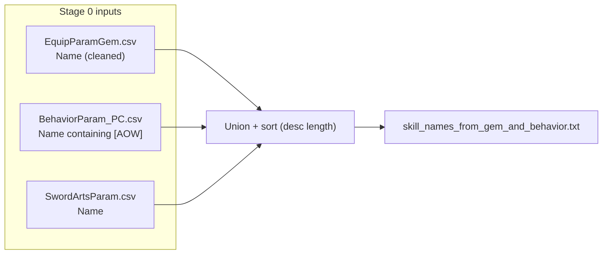
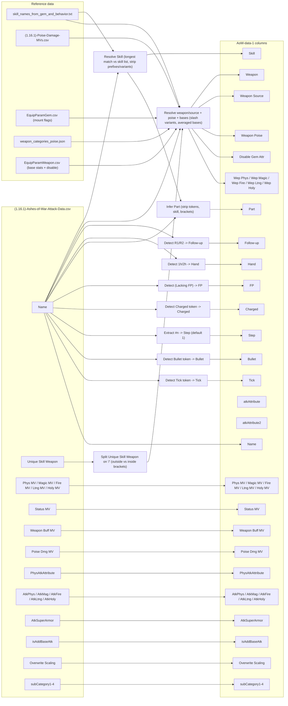
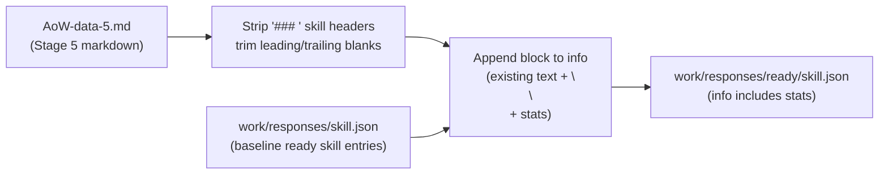

# AoW CSV Pipeline

This approach makes the skill data flow deterministic, debuggable, and repeatable by producing explicit on-disk CSV stages instead of doing ad-hoc, in-memory munging.

## Intent

- Collate all AoW rows we need into a single, minimal CSV with only the columns we care about.
- Resolve weapon/poise data deterministically: prefer per-weapon bases when they exist, otherwise fall back to category poise via mount flags.
- Keep every stage reproducible via scripts so we can regenerate when upstream CSVs change.
- Future stages stay pass-through until we design their transforms; this keeps the pipeline shape stable while we iterate.

## Stage 0: Build canonical skill list

- Input: `PARAM/EquipParamGem.csv`, `PARAM/BehaviorParam_PC.csv`, `PARAM/SwordArtsParam.csv`
- Output: `docs/skill_names_from_gem_and_behavior.txt` (longest-first sorted skill names for Stage 1 resolution)
- Behavior: collect Gem names (strip `Ash of War:` prefix, drop test rows), collect `[AOW]` Behavior names, collect SwordArts names, union them, sort, and write to disk. Reports Gem-only, Behavior-only, and SwordArts-only names when `--verbose` is passed (default output is just the row count + path).



## Stage 1: Build `AoW-data-1.csv`

- Inputs:
  - `docs/(1.16.1)-Ashes-of-War-Attack-Data.csv` (source rows; uses `Unique Skill Weapon` when present).
  - `docs/(1.16.1)-Poise-Damage-MVs.csv` (weapon-specific `Base` poise for unique weapons).
  - `PARAM/EquipParamGem.csv` (mount flags → weapon categories for non-unique skills).
  - `docs/weapon_categories_poise.json` (category → display name + poise).
- `docs/skill_names_from_gem_and_behavior.txt` (canonical skill list, longest-first matching; built by `scripts/build_aow/build_aow_stage0.py` from EquipParamGem + BehaviorParam_PC + SwordArtsParam).
- Output: `work/aow_pipeline/AoW-data-1.csv` (collated rows; no value transforms beyond lightweight labeling).
- Column shape (initial): `Name`, `Skill`, `Follow-up`, `Hand`, `Part`, `FP`, `Charged`, `Step`, `Bullet`, `Tick`, `Weapon Source`, `Weapon`, `Weapon Poise`, `Disable Gem Attr`, `atkAttribute`, `atkAttribute2`, `Wep Phys`, `Wep Magic`, `Wep Fire`, `Wep Ltng`, `Wep Holy`, `Phys MV`, `Magic MV`, `Fire MV`, `Ltng MV`, `Holy MV`, `Status MV`, `Wep Status`, `Weapon Buff MV`, `Poise Dmg MV`, `PhysAtkAttribute`, `AtkPhys`, `AtkMag`, `AtkFire`, `AtkLtng`, `AtkHoly`, `AtkSuperArmor`, `isAddBaseAtk`, `Overwrite Scaling`, `Skill Attr`, `subCategory1`, `subCategory2`, `subCategory3`, `subCategory4`.
- Resolution rules:
  - `Weapon`: if `Unique Skill Weapon` is populated, use it directly; else if the row name carries a `[Weapon Type]` prefix, use only that category unless the prefix is in the ignored list (`Slow`, `Var1`, `Var2`), in which case use the category mapping; otherwise, map the skill name to `EquipParamGem` mount flags **that have a valid `mountWepTextId` (not -1)** and emit the human-readable category names (space-separated).
  - `Unique Skill Weapon` slash handling: split `/` outside brackets into `|`; when `/` appears inside parentheses, attach each option to the surrounding text (`(Nightrider / Chainlink) Flail` → `Nightrider Flail | Chainlink Flail`; `Flail (Nightrider / Chainlink)` → `Flail Nightrider | Flail Chainlink`). `Weapon Poise` resolves per variant (pipe-aligned), and `Wep Phys`/`Wep Magic`/`Wep Fire`/`Wep Ltng`/`Wep Holy` are averaged across all variant weapons.
  - `Weapon` and `Weapon Poise` are pipe-delimited (` | `) lists to keep multi-word names intact; counts stay aligned (same number of entries in both fields).
  - `Weapon Poise`: if a unique weapon is present, read its `Base` from `Poise-Damage-MVs` (with category fallback when needed); if a bracketed weapon prefix is present, look up that category’s base poise; otherwise, emit category poise values from `weapon_categories_poise.json` aligned with the `Weapon` list.
  - `Disable Gem Attr`: for `Weapon Source` == `unique`, pull `disableGemAttr` from `EquipParamWeapon`; when multiple unique variants are listed, align per-weapon values (pipe-joined) and keep a single value only when all variants match; otherwise `-`.
  - `atkAttribute` / `atkAttribute2`: for `Weapon Source` == `unique`, pull the weapon fields from `EquipParamWeapon`; when multiple unique variants are listed, align per-weapon values (pipe-joined) and keep a single value only when all variants match; otherwise `-`. Non-unique rows emit `-`.
  - `Skill Attr`: map the skill’s `defaultWepAttr` from `EquipParamGem` through `work/aow_pipeline/skill_attr_scaling.json` (`stat` field), per canonical skill; defaults to `-` when missing.
  - `Wep Status`: for `Weapon Source` == `unique`, resolve per-weapon `spEffectBehaviorId0/1/2` from `EquipParamWeapon` when that weapon’s `Disable Gem Attr` == `1`; drop `-1`, map IDs to `SpEffectParam` names (trim text after the first `-`, strip leading bracketed tags like `[Weapon]`, special-case `Thiollier's Hidden Needle` → `Sleep`), dedupe per weapon, and pipe-join per-weapon results to mirror the `Weapon` field (even when identical). If a weapon has no non-`-1` entries, emit `None` for that slot. When every slot is `None`, emit `None`; when all are `-`, emit `-`; otherwise pipe-join the per-weapon strings. Non-unique rows emit `-`.
  - `Wep Phys`/`Wep Magic`/`Wep Fire`/`Wep Ltng`/`Wep Holy`: for `Weapon Source` == `unique`, pull `attackBasePhysics`/`attackBaseMagic`/`attackBaseFire`/`attackBaseThunder`/`attackBaseDark` from `EquipParamWeapon` by weapon name (averaging when multiple unique weapons are listed); otherwise `-`.
  - `FP`: `0` when the name contains `(Lacking FP)`, else `1`.
  - `Charged`: `1` when the name contains `Charged`, else `0`.
  - `Part`: inferred from name tokens without charged/hand/follow-up labels; removes `Bullet` and strips outer parentheses when the whole part is wrapped. Defaults to `Hit`, with `Loop` preserved when present.
  - `Part` cleanup: splits multiple bracketed fragments into comma-separated components (e.g., `2x (Right)` → `2x, Right`; `[Hit] (Stomp AoE)` → `[Hit], Stomp AoE`).
  - `Part` for bullets: if `Bullet` = `1`, force `Part` to `Bullet` so bullet-only rows no longer appear as `Hit`.
  - `Tick`: `1` when the name contains the token `Tick` (and it is removed from `Part` inference), else `0`.
  - `Follow-up`: `Light` when the name contains `R1`, `Heavy` when it contains `R2`, else `-`.
  - `Hand`: detects `1h`/`2h` in the name, otherwise `-`.
  - `Step`: number after `#` in the name; defaults to `1` when absent.
  - `Bullet`: `1` when the name contains `Bullet`, else `0`.



## Stage 2: Collapse duplicate rows

- Input: `work/aow_pipeline/AoW-data-1.csv`
- Output: `work/aow_pipeline/AoW-data-2.csv`
- Behavior:
  - Normalize subCategory labels before grouping: `Charged Weapon Skill` → `Charged Skill`, `Charged R2` → `Charged Attack`, `Roar Attack` → `Roar`.
  - Optional value blacklist (`work/aow_pipeline/value_blacklist.json`): drop listed values per stage/column before processing (currently strips `128 - unused` from `subCategory1-4` in Stage 2).
  - Optional row copies (`work/aow_pipeline/copy_rows.json`): duplicate specific Stage 1 `Name` rows with per-copy column overrides (keyed by the CSV headers) before processing. Entries look like `{"name": "Storm Blade - Bullet", "copies": [{"overrides": {"Step": "2"}}, ...]}` and apply overrides to every matching row.
  - Apply optional forced collapses defined in `work/aow_pipeline/force_collapse_pairs.json`:
    - Accepts entries as a list of names, or an object with `names` and optional `overrides`.
    - All rows in a group are canonicalized to the first name’s derived fields (`Name`, `Skill`, `Follow-up`, `Hand`, `Part`, `FP`, `Charged`, `Step`, `Bullet`, `Tick`) unless a specific override for that field is provided.
    - Overrides apply before grouping/aggregation (affecting derived fields like `Dmg Type`). Current file includes Prelate’s Charge fire ticks and Bloodboon Ritual groups (with `PhysAtkAttribute: Standard` and `Bullet: 1`), plus a Loretta’s Slash pairing.
    - Warnings are still emitted for non-overridden, non-numeric fields (including Weapon Source/Weapon/Weapon Poise/Disable Gem Attr/atkAttribute/atkAttribute2/PhysAtkAttribute/isAddBaseAtk/Overwrite Scaling/subCategory*) when values disagree inside a forced group; name-derived fields are suppressed from warnings because they are explicitly canonicalized.
    - Forced groups are reported after the write; disagreements still surface in `Warnings`, now alongside the forced summary.
- Group by `Skill`, `Follow-up`, `Hand`, `Part`, `FP`, `Charged`, `Step`, `Bullet`, `Weapon`, `PhysAtkAttribute`, `isAddBaseAtk`, `Overwrite Scaling`.
- Drop `Name`, `Tick`, `AtkId`; keep `PhysAtkAttribute` only for grouping/overrides (not in output).
- Sum numeric columns from `Phys MV` onward (except `PhysAtkAttribute`); non-numeric fields in that range keep the first value (`subCategory*`, etc.); columns before `Phys MV` keep the first value.
- Zero any MV whose corresponding `Wep *` value is 0 when `Disable Gem Attr` = 1.
- Drop rows entirely when every MV/Atk column is 0 after zeroing (Phys/Magic/Fire/Ltng/Holy/Status/Weapon Buff/Poise Dmg MVs and AtkPhys/AtkMag/AtkFire/AtkLtng/AtkHoly plus summed AtkSuperArmor).
- Rename `Weapon Poise` → `Wep Poise Range`, collapsing pipe-delimited values to a min–max string (single values stay single).
- Rename `Poise Dmg MV` → `Stance Dmg`, computing a min–max integer range from `Wep Poise Range` × original `Poise Dmg MV` ÷ 100, then adding summed `AtkSuperArmor` (half-up rounding). `AtkSuperArmor` is removed from the output columns.
- `Wep Status` carries through as a first-value field (non-numeric) and stays after `Status MV`.
- Add derived columns after `Holy MV`: `Dmg Type n`/`Dmg MV n` pairs (up to five). When two or more elemental MVs are identical, Stage 2 collapses them into a single `Damage` entry (with `({PhysAtkAttribute} Physical)` suffix when Phys MV is present and PhysAtkAttribute is not 252/253; the suffix is omitted when both `atkAttribute` and `atkAttribute2` match the phys attr) using the raw MV value. Phys rows stay weapon-type when only phys exists; when 2–4 elements exist and Phys MV is present we emit `{PhysAtkAttribute}` (or `Weapon` for 252/253) as `Dmg Type 1`. When all five MVs are non-zero, Stage 2 collapses them into a single `Weapon` entry whose `Dmg MV 1` is the per-element average. Non-phys types (Magic/Fire/Ltng/Holy) inherit the column header name for their `Dmg Type n`. MV payloads are scaled by the ratio of that weapon’s base element to the average of the non-zero bases so mixed element rows weight correctly.

```mermaid
flowchart LR
  copyRules["copy_rows.json (optional)"]

  subgraph Stage2Inputs["AoW-data-1.csv columns"]
    name1["Name (dropped)"]
    skill1["Skill"]
    follow1["Follow-up"]
    hand1["Hand"]
    part1["Part"]
    fp1["FP"]
    charged1["Charged"]
    step1["Step"]
    bullet1["Bullet"]
    tick1["Tick (dropped)"]
    weaponSrc1["Weapon Source"]
    weapon1["Weapon"]
    weaponPoise1["Weapon Poise"]
    disable1["Disable Gem Attr"]
    atkAttr1["atkAttribute"]
    atkAttr21["atkAttribute2"]
    wepBases1["Wep Phys / Wep Magic / Wep Fire / Wep Ltng / Wep Holy"]
    elemMVs1["Phys MV / Magic MV / Fire MV / Ltng MV / Holy MV"]
    status1["Status MV"]
    wepStatus1["Wep Status"]
    buff1["Weapon Buff MV"]
    poiseMV1["Poise Dmg MV"]
    physAttr1["PhysAtkAttribute (dropped after grouping)"]
    atkStats1["AtkPhys / AtkMag / AtkFire / AtkLtng / AtkHoly"]
    atkSA1["AtkSuperArmor (summed, removed)"]
    isAdd1["isAddBaseAtk"]
    overwrite1["Overwrite Scaling"]
    subCats1["subCategory1-4"]
    forceRules["force_collapse_pairs.json (optional)"]
  end

  subgraph Stage2Outputs["AoW-data-2 columns"]
    out2Skill["Skill"]
    out2Follow["Follow-up"]
    out2Hand["Hand"]
    out2Part["Part"]
    out2FP["FP"]
    out2Charged["Charged"]
    out2Step["Step"]
    out2Bullet["Bullet"]
    out2WeaponSrc["Weapon Source"]
    out2Weapon["Weapon"]
    out2WepPoise["Wep Poise Range"]
    out2Disable["Disable Gem Attr"]
    out2AtkAttr["atkAttribute"]
    out2AtkAttr2["atkAttribute2"]
    out2WepBases["Wep Phys / Wep Magic / Wep Fire / Wep Ltng / Wep Holy"]
    out2ElemMVs["Phys MV / Magic MV / Fire MV / Ltng MV / Holy MV"]
    out2DmgType["Dmg Type 1..5"]
    out2DmgMV["Dmg MV 1..5"]
    out2Status["Status MV"]
    out2WepStatus["Wep Status"]
    out2Buff["Weapon Buff MV"]
    out2Stance["Stance Dmg"]
    out2AtkStats["AtkPhys / AtkMag / AtkFire / AtkLtng / AtkHoly"]
    out2IsAdd["isAddBaseAtk"]
    out2Overwrite["Overwrite Scaling"]
    out2SkillAttr["Skill Attr"]
    out2SubCats["subCategory1-4"]
  end

  elemMVs1 --> sumMVs["Sum Phys/Magic/Fire/Ltng/Holy MV per group"]
  status1 --> sumStatus["Sum Status MV per group"]
  wepStatus1 --> carryWepStatus["Carry first Wep Status"]
  buff1 --> sumBuff["Sum Weapon Buff MV per group"]
  poiseMV1 --> sumPoiseMV["Sum Poise Dmg MV per group"]
  atkStats1 --> sumAtkStats["Sum AtkPhys/AtkMag/AtkFire/AtkLtng/AtkHoly per group"]
  atkSA1 --> sumAtkSA["Sum AtkSuperArmor per group"]

  weaponPoise1 --> collapsePoise["Collapse Weapon Poise pipes -> Wep Poise Range"]

  wepBases1 --> carryWepBases["Carry first Wep Phys/Magic/Fire/Ltng/Holy"]
  weaponSrc1 --> carryWeaponSrc["Carry first Weapon Source"]
  disable1 --> carryDisable["Carry first Disable Gem Attr"]
  skill1 --> carrySkill["Carry first Skill"]
  follow1 --> carryFollow["Carry first Follow-up"]
  hand1 --> carryHand["Carry first Hand"]
  part1 --> carryPart["Carry first Part"]
  fp1 --> carryFP["Carry first FP"]
  charged1 --> carryCharged["Carry first Charged"]
  step1 --> carryStep["Carry first Step"]
  bullet1 --> carryBullet["Carry first Bullet"]
  weapon1 --> carryWeapon["Carry first Weapon"]
  isAdd1 --> carryIsAdd["Carry first isAddBaseAtk"]
  overwrite1 --> carryOverwrite["Carry first Overwrite Scaling"]
  subCats1 --> subCatRename["Normalize subCategory labels"]
  subCatRename --> carrySubCats["Carry first subCategory1-4"]
  
  skill1 --> groupKeys
  follow1 --> groupKeys
  hand1 --> groupKeys
  part1 --> groupKeys
  fp1 --> groupKeys
  charged1 --> groupKeys
  step1 --> groupKeys
  bullet1 --> groupKeys
  weapon1 --> groupKeys
  physAttr1 --> groupKeys
  isAdd1 --> groupKeys
  overwrite1 --> groupKeys
  copyRules --> copyApply["Duplicate rows + overrides"]
  copyApply --> name1
  copyApply --> skill1
  copyApply --> follow1
  copyApply --> hand1
  copyApply --> part1
  copyApply --> fp1
  copyApply --> charged1
  copyApply --> step1
  copyApply --> bullet1
  copyApply --> tick1
  copyApply --> weaponSrc1
  copyApply --> weapon1
  copyApply --> weaponPoise1
  copyApply --> disable1
  copyApply --> wepBases1
  copyApply --> elemMVs1
  copyApply --> status1
  copyApply --> wepStatus1
  copyApply --> buff1
  copyApply --> poiseMV1
  copyApply --> physAttr1
  copyApply --> atkStats1
  copyApply --> atkSA1
  copyApply --> isAdd1
  copyApply --> overwrite1
  copyApply --> subCats1

  forceRules --> forceCanon["Canonicalize forced groups (first entry + overrides)"]
  name1 --> forceCanon
  skill1 --> forceCanon
  follow1 --> forceCanon
  hand1 --> forceCanon
  part1 --> forceCanon
  fp1 --> forceCanon
  charged1 --> forceCanon
  step1 --> forceCanon
  bullet1 --> forceCanon
  tick1 --> forceCanon
  physAttr1 --> forceCanon
  isAdd1 --> forceCanon
  overwrite1 --> forceCanon
  subCats1 --> forceCanon
  forceCanon --> groupKeys

  groupKeys --> agg["Group + aggregate rows"]
  sumMVs --> agg
  sumStatus --> agg
  sumBuff --> agg
  sumPoiseMV --> agg
  sumAtkStats --> agg
  sumAtkSA --> agg
  collapsePoise --> agg
  carryWepBases --> agg
  carryWeaponSrc --> agg
  carryDisable --> agg
  carrySkill --> agg
  carryWepStatus --> agg
  carryFollow --> agg
  carryHand --> agg
  carryPart --> agg
  carryFP --> agg
  carryCharged --> agg
  carryStep --> agg
  carryBullet --> agg
  carryWeapon --> agg
  carryIsAdd --> agg
  carryOverwrite --> agg
  carrySubCats --> agg
  physAttr1 -. grouping only .-> agg

  agg --> zeroing["Zero MV when Disable Gem Attr = 1 and matching Wep * = 0"]
  agg --> wepRange["Collapse Weapon Poise pipes -> Wep Poise Range"]
  agg --> stanceBase["Use summed Poise Dmg MV + summed AtkSuperArmor"]
  agg --> passStatus["Pass summed Status MV"]
  agg --> passBuff["Pass summed Weapon Buff MV"]
  agg --> passAtkStats["Pass summed AtkPhys/AtkMag/AtkFire/AtkLtng/AtkHoly"]
  agg --> passMeta["Pass first-value columns (Skill, Follow-up, Hand, Part, FP, Charged, Step, Bullet, Weapon Source, Weapon, Disable Gem Attr, atkAttribute, atkAttribute2, Wep Phys/Magic/Fire/Ltng/Holy, isAddBaseAtk, Overwrite Scaling, subCategory1-4)"]

  zeroing --> dropZero["Drop rows when all MV/Atk values (incl AtkSuperArmor) sum to 0"]
  passStatus --> dropZero
  passBuff --> dropZero
  passAtkStats --> dropZero
  stanceBase --> dropZero

  dropZero --> dmgMeta["Dmg Type + Dmg MV derived from MVs<br>(equal MVs -> single 'Damage' entry)"]
  physAttr1 --> dmgMeta
  dropZero --> out2ElemMVs

  stanceBase --> stanceDmg["Stance Dmg = Wep Poise Range × Poise Dmg MV / 100 + summed AtkSuperArmor (half-up)"]
  wepRange --> stanceDmg
  dropZero --> stanceDmg
  stanceDmg --> out2Stance

  name1 -. dropped .-> out2Skill
  tick1 -. dropped .-> out2Skill
  physAttr1 -. dropped after grouping .-> out2Skill
  atkSA1 -. removed after use .-> out2Skill

  passMeta --> out2Skill
  passMeta --> out2Follow
  passMeta --> out2Hand
  passMeta --> out2Part
  passMeta --> out2FP
  passMeta --> out2Charged
  passMeta --> out2Step
  passMeta --> out2Bullet
  passMeta --> out2WeaponSrc
  passMeta --> out2Weapon
  wepRange --> out2WepPoise
  passMeta --> out2Disable
  passMeta --> out2WepBases
  dmgMeta --> out2DmgType
  dmgMeta --> out2DmgMV
  dropZero --> out2Status
  agg --> out2WepStatus
  dropZero --> out2Buff
  dropZero --> out2AtkStats
  passMeta --> out2IsAdd
  passMeta --> out2Overwrite
  passMeta --> out2SubCats
```



## Stage 3: Collapse per skill/weapon and build FP/Charged step strings

- Input: `work/aow_pipeline/AoW-data-2.csv`
- Output: `work/aow_pipeline/AoW-data-3.csv` (grouped rows with FP/Charged/Step strings and trimmed metadata).
- Script: `scripts/build_aow/build_aow_stage3.py` (pads numeric layouts, merges weapons, and concatenates per-skill stats).
- Behavior:
  - Drop `Wep Poise Range`, `Disable Gem Attr`, `Wep Phys/Magic/Fire/Ltng/Holy`, `isAddBaseAtk`, `subCategory1-4` after deriving aggregates.
  - Build a shared FP/Charged/Step layout per `Skill`/`Follow-up`/`Hand`; zero-pad missing combos to keep shapes aligned across Parts/Weapons.
  - Sum rows that share the same FP/Charged/Step slot before padding; treat `-`/empty as 0.
  - Borrow supporting stats across rows with matching layouts (fills zeros in `Status MV`/`Weapon Buff MV`/`Stance Dmg`/`Atk*` from non-zero peers, blanking donors when emptied).
  - Carry the numbered `Dmg Type`/`Dmg MV` columns through aggregation so every collapsed row retains up to five parallel damage entries; layouts apply to each MV column independently.
  - During weapon merge, compare the FP/Charged layouts for every `Dmg MV n` column; when compatible, collapse differing numeric positions into min–max ranges so weapon-derived variance is preserved inside a single row rather than duplicating rows. Dmg Type cells treat `-`/empty as wildcards but block merges when typed entries conflict, and all numbered `Dmg MV` columns are range-collapsed together.
  - After weapon merges, sum supporting stats (`Status MV`, `Weapon Buff MV`, `Stance Dmg`, `AtkPhys`/`AtkMag`/`AtkFire`/`AtkLtng`/`AtkHoly`) across rows that share `Skill`/`Follow-up`/`Hand`/`Part`/`Weapon`, storing totals in the first row and blanking the donors; the `Dmg Type n`/`Dmg MV n` columns stay per-row but their numeric payloads collapse into min–max ranges when weapons disagree.
  - Collapse Part when redundant: if every row for a `Skill`/`Follow-up`/`Hand` shares the same Part, set it to `-`.
  - Build `subCategorySum` as a deduped, order-preserving union of `subCategory1-4` (skip `-`/empty; ignore `2h Attack` when Hand is `2h`), concatenating with ` | ` when weapon-merge joins differing sets.
  - `Overwrite Scaling`: join unique non-empty values with `,` (falls back to first non-empty, then `-`).
  - Two-pass weapon merge:
    - Pass 1: group by `Skill`/`Follow-up`/`Hand`/`Part`/`Weapon`/`Dmg Type`/`Wep Status`; pad/aggregate numeric columns into FP/Charged/Step strings.
    - Pass 2: merge rows with identical non-weapon fields and matching numeric shapes; dedupe/sort weapon names, join `Weapon Source` with `|`, collapse differing `Wep Status` to `-` (when none are `None`), and convert differing numeric positions into ranges (`min-max`; keep single when identical). Rows with incompatible shapes stay separate.
  - After merge, replace any numeric cell that is all zeros (including ranged forms) with `-`.
  - Output columns: `Skill`, `Follow-up`, `Hand`, `Part`, `Weapon Source`, `Weapon`, `Dmg Type`, `Dmg MV`, `Status MV`, `Wep Status`, `Weapon Buff MV`, `Stance Dmg`, `AtkPhys/AtkMag/AtkFire/AtkLtng/AtkHoly`, `Overwrite Scaling`, `subCategorySum`.


## Stage 4: Text helper columns

- Input: `work/aow_pipeline/AoW-data-3.csv`
- Output: `work/aow_pipeline/AoW-data-4.csv` (adds text helper fields for markdown/ready ingestion).
- Script: `scripts/build_aow/build_aow_stage4.py` (formats text helpers; colors are disabled by default and enabled with `--color`).
- Behavior:
  - Normalize `subCategorySum`: split on `|`, strip empties/`-`, dedupe preserving order.
  - Zero-only columns (`Status MV`, `Weapon Buff MV`, `Stance Dmg`, `Atk*`, etc.) become `-` when every numeric token is zero. `Dmg MV n` columns are left intact so they can render even when zero.
  - Text helpers (skip columns that are `-`/empty):
    - `Text Wep Dmg`: now always `-`; individual damage lines move into the elemental helpers.
    - `Text Wep Status`: `{Wep Status|Status} (%)` label (colored per ailment when `--color` is set) + raw `Status MV` payload with FP/charged coloring; emits `-` when status data missing/zero/None.
    - `Text Stance`: `Stance:` label (header color when `--color` is set) + `Stance Dmg` payload with FP/charged coloring; `-` when empty.
    - `Text Phys/Mag/Fire/Ltng/Holy`: built from the numbered `Dmg Type`/`Dmg MV` pairs and merged with the matching `Atk*` columns when present (range-aware sums). `[AR]` is appended only when a Dmg MV contributes; `[{Overwrite Scaling}]` is appended only when an `Atk*` contribution exists for that element.
    - When `Overwrite Scaling` = `-` and an elemental helper line lacks `[AR]`, append ` [Weapon {Skill Attr} Scaling]` using the Stage 1 `Skill Attr` value (e.g., `Glintstone Pebble` → `Weapon Int Scaling`).
    - `Text Name`, `Text Category` placeholders are seeded empty for downstream use.
  - Drops numeric/raw columns no longer needed: the numbered `Dmg Type n`/`Dmg MV n` pairs, `Status MV`, `Wep Status`, `Stance Dmg`, `Weapon Source`, `Overwrite Scaling`, base `Atk*`, weapon base columns, poise metadata.
  - Coloring (opt-in via `--color`): uses Stage 4 palette for elements/status/stance; FP-less and charged FP-less blocks collapse to single wrappers to avoid redundant tags. `--no-color`/default disables all font tags (plain text).


## Stage 5: Markdown render

- Input: `work/aow_pipeline/AoW-data-4.csv`
- Output: `work/aow_pipeline/AoW-data-5.md` (markdown skill summary; color depends on Stage 4).
- Script: `scripts/build_aow/build_aow_stage5.py` (renders Stage 4 text helpers into nested markdown).
- Behavior:
  - Group by `Skill`; when multiple distinct `Weapon` values exist, emit a `#### {Weapon}` section per value (pipe-joined lists stay together).
  - If exactly one weapon heading contains multiple weapons (pipe-joined) and others are single-weapon headings, label the multi-weapon heading as `All Weapons`.
  - Within each skill/weapon group, render blocks based on `Follow-up`/`Hand`/`Part` presence, indenting nested parts and skipping `Text *` lines that are `-`. Parts under the same header are merged so a single header owns multiple parts instead of repeating the label.
  - Add `### [ ] Skill` headers by default; preserve existing `[x]` headers (skip regenerating those sections) unless `--force` is passed, which converts them to `[<]` and rewrites the section.
  - If any row in a skill has a `Follow-up`, rows lacking a follow-up label render as `Skill`.
  - When follow-ups are present, `subCategorySum` is applied to the follow-up/Skill header (not to individual parts) so shared tags appear once per header.
  - Collapse duplicate parts under the same heading/subheading so their detail lines merge into a single block; normalize labels (`Damage` → `Weapon`, physical aliases → Standard/Slash/Pierce/Strike) before sorting. Data lines (including when merged blocks contribute multiple entries under one heading) are re-sorted per label priority so Stance always trails damage/status. Damage/status lines are ordered Standard → Strike → Slash → Pierce → Magic → Fire → Lightning → Holy → Poison → Deadly Poison → Scarlet Rot → Blood Loss → Frostbite → Sleep → Eternal Sleep → Madness → Death Blight → Status (%) → Stance.
  - Skip any row that would render no text helper lines, avoiding empty duplicate headings when follow-up/hand combos carry no payload.
  - `subCategorySum` is reformatted with commas (instead of pipes) and tight `/`.
  - Output stays colourised when Stage 4 used colors; pair with Stage 5 colorizer (below) when Stage 4 ran with `--no-color`.
  - Console output reports how many sections changed; when <=5, it prints before/after blocks for each changed section.
  - Output ends with a trailing blank line and `---` marker for stable diffs/EOF linting; the marker is ignored when re-parsing so section diffs stay clean.
- Feeds Stage 6, which embeds these markdown blocks into `ready/skill.json` info fields.

```mermaid
flowchart LR
  subgraph Stage5In["AoW-data-4.csv columns"]
    s5Skill["Skill"]
    s5Follow["Follow-up"]
    s5Hand["Hand"]
    s5Part["Part"]
    s5Weapon["Weapon"]
    s5TextWepDmg["Text Wep Dmg (unused placeholder)"]
    s5TextWepStatus["Text Wep Status"]
    s5TextStance["Text Stance"]
    s5TextPhys["Text Phys"]
    s5TextMag["Text Mag"]
    s5TextFire["Text Fire"]
    s5TextLtng["Text Ltng"]
    s5TextHoly["Text Holy"]
    s5SubCat["subCategorySum"]
  end

  groupSkill["Group by Skill<br>emit ### Skill"]
  weaponSplit["Split blocks per Weapon when multiple values<br>emit #### {Weapon}"]
  layoutLines["Render lines by Follow-up/Hand/Part<br>indent nested parts; drop '-' helpers<br>normalize labels + sort lines (damage before Stance)"]

  subgraph Stage5Out["AoW-data-5.md"]
    o5["Markdown skill blocks<br>(colour depends on Stage 4/no-color)"]
  end

  Stage5In --> groupSkill --> weaponSplit --> layoutLines --> o5
```



## Optional: Stage 5 colorizer (plain → coloured)

- Input: `work/aow_pipeline/AoW-data-5.md` generated without colours (e.g., Stage 4 run with `--no-color`).
- Output: `work/aow_pipeline/AoW-data-5-colored.md` (mirrors Stage 5 coloured output).
- Script: `scripts/build_aow/build_aow_stage5_color.py` (reapplies Stage 4 colour rules to damage/status/stance and FP/charged spans).
- Behavior highlights:
  - Supports multiple charged tiers: first charged values use `#eed5b1ff` (main) / `#cdc2b6ff` (FP-less), last charged values use `#ffd59aff` / `#dabd9dff`, and intermediates interpolate between them; charged dividers use `#d9e0e0ff`.
- Usage: `python scripts/build_aow/build_aow_stage5_color.py --input work/aow_pipeline/AoW-data-5.md --output work/aow_pipeline/AoW-data-5-colored.md` (paths optional).

## Stage 6: Append markdown stats into ready skill info

- Inputs:
  - `work/aow_pipeline/AoW-data-5.md` (Stage 5 markdown output).
  - `work/responses/skill.json` (baseline ready skill entries).
- Output: `work/responses/ready/skill.json` (info fields appended with Stage 5 stats).
- Script: `scripts/build_aow/build_aow_stage6.py` (parses markdown, strips `###` headers, trims blank edges, and appends the per-skill block to `info` with a `\n\n` separator; skips skills missing in the markdown).
- Behavior:
  - Keeps existing `info` text and appends the markdown block directly (no separate `stats` field).
  - Escapes JSON appropriately (`ensure_ascii=False`, `indent=2`), preserves UTF-8 font tags, and leaves skills without a matching markdown block untouched.



## Filesystem layout

- `docs/aow_pipeline_overview.md` (this plan).
- `docs/AoW-data-1_example.csv` (authoritative sample rows for reference).
- `docs/skill_names_from_gem_and_behavior.txt` (canonical skill names derived from EquipParamGem + Behavior + SwordArts).
- `work/aow_pipeline/AoW-data-1.csv` (generated Stage 1 output).
- `work/aow_pipeline/AoW-data-2.csv` (generated Stage 2 output).
- `work/aow_pipeline/AoW-data-3.csv` (generated Stage 3 collapsed output).
- `work/aow_pipeline/AoW-data-4.csv` (generated Stage 4 text-helper output).
- `work/aow_pipeline/AoW-data-5.md` (Stage 5 markdown render consumed by Stage 6).
- `work/aow_pipeline/AoW-data-5-colored.md` (optional coloured render when Stage 4 ran with `--no-color`).
- `work/aow_pipeline/force_collapse_pairs.json` (forced collapse groups + overrides applied in Stage 2).
- `work/aow_pipeline/` (workspace for outputs and scratch; add temp files as needed).
- `scripts/build_aow/build_aow_stage0.py` (skill list), `scripts/build_aow/build_aow_stage1.py` (stage 1 collate), `scripts/build_aow/build_aow_stage2.py` (stage 2 collapse), `scripts/build_aow/build_aow_stage3.py` (stage 3 collapse + FP/Charged strings), `scripts/build_aow/build_aow_stage4.py` (stage 4 text helpers), `scripts/build_aow/build_aow_stage5.py` (stage 5 markdown render), `scripts/build_aow/build_aow_stage6.py` (stage 6 ready population).
- `scripts/build_aow/build_aow_stage5_color.py` (optional Stage 5 colourizer when Stage 4 output is plain).
- `Makefile` (`make stage0|stage1|stage2|stage3|stage4|stage5|stage6|stages` with optional flags passed after the target).

## How to regenerate Stage 1

```sh
python scripts/build_aow/build_aow_stage1.py
# optional: choose another output
python scripts/build_aow/build_aow_stage1.py --output work/aow_pipeline/custom.csv
```

Regenerate whenever upstream CSVs change. The script reports any skills missing mount categories or poise lookups so we can patch inputs instead of silently guessing.

## Quickstart

```sh
# 1) Build the unified skill list (Gem + Behavior + SwordArts)
python scripts/build_aow/build_aow_stage0.py
# 2) Generate the collated AoW data
python scripts/build_aow/build_aow_stage1.py
# 3) Collapse duplicate rows and sum numeric columns
python scripts/build_aow/build_aow_stage2.py
# 4) Collapse to FP/Charged/Step strings
python scripts/build_aow/build_aow_stage3.py
# 5) Add text helper columns
python scripts/build_aow/build_aow_stage4.py
# 6) Render markdown helper output
python scripts/build_aow/build_aow_stage5.py
# 7) (Optional) If Stage 4 was run with --no-color, recolor markdown
python scripts/build_aow/build_aow_stage5_color.py
# 8) Append markdown stats into ready/skill.json info fields
python scripts/build_aow/build_aow_stage6.py
# or via make (flags can be passed after the target):
#   make stage6 --output work/responses/ready/skill.json
```

## Remaining Implementation

Checklist of the legacy `scripts/generate_skill_stats.py` behaviors we still need to cover in the CSV pipeline:

- [x] Sum duplicate-name rows in the attack CSV across numeric columns before any other processing.
- [x] Derive weapon labels from `Unique Skill Weapon` or `[Weapon]` prefixes; flag unique skills and keep `Var*` prefix variants separate. (Stage 1 emits `Weapon`/`Weapon Source` from unique/prefix/category; note Var* prefixes are intentionally dropped per current plan.)
- [x] Pull stance bases from Poise MVs for unique weapons; otherwise resolve categories from EquipParamGem mount flags (skipping `mountWepTextId == -1`), with exact/fuzzy/token matching against weapon labels and fallback to category/base poise when missing. (Stage 1 fills `Weapon Poise` from unique Base or category poise with missing warnings.)
- [x] Normalize names: strip `#n`/step numbers, remove extra numeric tails, canonicalize spacing, and record hash IDs for step ordering.
- [x] Parse labels: peel `(Lacking FP)`, split `X - Y` suffixes, capture R1/R2 follow-ups, trailing bracket tokens, and bracketed numbers into a phase label; detect hand mode (`1h`/`2h`).
- [ ] Filter generation via `--ready-only` (canonical + bracket-stripped name/weapon matches) and `--only-skills`/file lists.
- [ ] Build per-row stat lines: pick the highest MV column for the weapon-damage line, use PhysAtkAttribute for physical type, append scaling suffix from `Overwrite Scaling`; emit base/bullet lines when `isAddBaseAtk` is true or base damage exists; emit status multiplier from `Status MV`/100; emit stance damage from `Stance Dmg` (Stage 2 now applies `Poise Dmg MV` × `Wep Poise Range` + summed `AtkSuperArmor`), carrying stance base/category metadata.
- [ ] Group lines by canonical skill + weapon label, tracking uniqueness and first-seen hand mode; drop rows with no lines.
- [ ] Collapse bracketed phases ([1], [2], etc.) and merge FP/lacking pairs, synthesizing zeroed bases when only lacking exists and carrying stance super-armor (including lacking variants).
- [ ] Align hash/step variants per descriptor/phase/hand/kind, padding missing steps with zeros; order by follow-up priority (Light/R1 before Heavy/R2), hand mode (1h before 2h), then kind/descriptor/phase.
- [ ] Prefix labels with hand mode and follow-up, keep phase text, and build merge keys so identical lines across variants can be merged later.
- [ ] Apply stance scaling factors (category/base poise ÷ 100) with additive super-armor, producing min/max ranges per step and dropping lacking blocks when all zeros.
- [ ] Merge stance lines for the same prefix/label into range buckets (ceil rounding), keep merge keys, and trim nested `(Bullet (X))` labels to `(X)` when unique.
- [ ] Merge variant lines (e.g., weapon/charged splits): per-prefix step padding, propagate lacking when any variant has it, special-case clone for missing “water aoe” in two-variant buckets, then render combined font-colored lines with comma-separated steps, `|`-separated variants, optional `[lacking]`, and `x` suffixes for multipliers.
- [ ] Pair charged/uncharged outputs per weapon-set/uniqueness/hand-mode key, synthesizing empty partners when missing; emit standalone entries when only one side exists.
- [ ] Deduplicate variants with identical line signatures across weapon labels (including weaponless base merging all weapons) and merge identical final stats per skill name into combined weapon lists.
- [ ] Support versioned snapshots (`--append-version-key`, optional preserve-latest) and partial regeneration that preserves existing entries/order.
- [ ] Write JSON with `stats` lines and `weapon` lists; normalize stance strings (round base, ceil lacking) before output.
- [ ] Populate `work/responses/ready/skill.json` without overwriting user `stats`: add bracketed `[Weapon/... ] Skill` keys for variants, dedupe identical stats blocks, insert near `info` when present, and attach aggregated weapon lists.
