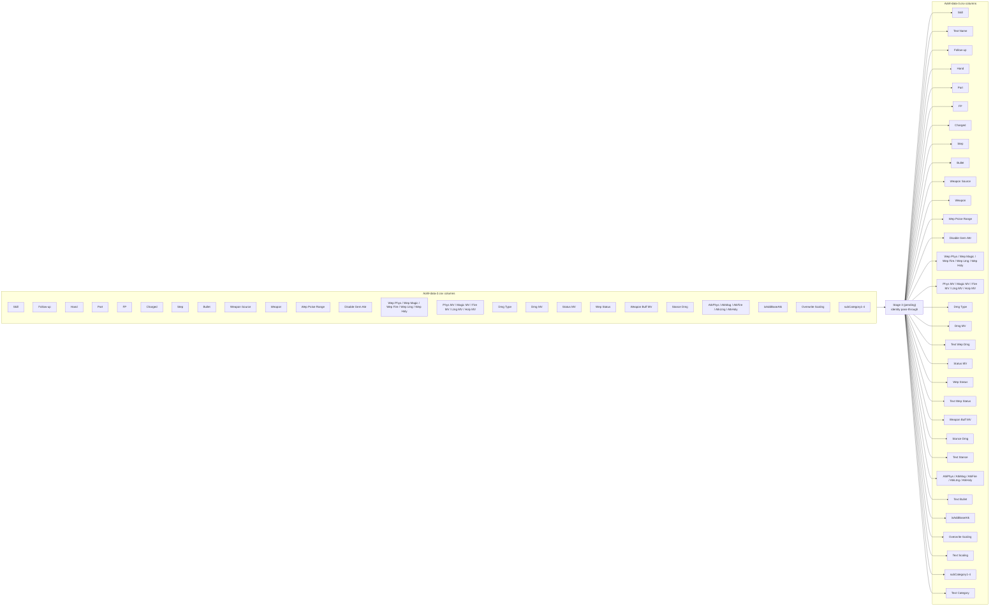

# AoW CSV Pipeline

This approach makes the skill data flow deterministic, debuggable, and repeatable by producing explicit on-disk CSV stages instead of doing ad-hoc, in-memory munging.

## Intent

- Collate all AoW rows we need into a single, minimal CSV with only the columns we care about.
- Resolve weapon/poise data deterministically: prefer per-weapon bases when they exist, otherwise fall back to category poise via mount flags.
- Keep every stage reproducible via scripts so we can regenerate when upstream CSVs change.
- Future stages stay pass-through until we design their transforms; this keeps the pipeline shape stable while we iterate.

## Stage 0: Build canonical skill list

- Input: `PARAM/EquipParamGem.csv`, `PARAM/BehaviorParam_PC.csv`, `PARAM/SwordArtsParam.csv`
- Output: `docs/skill_names_from_gem_and_behavior.txt` (longest-first sorted skill names for Stage 1 resolution)
- Behavior: collect Gem names (strip `Ash of War:` prefix, drop test rows), collect `[AOW]` Behavior names, collect SwordArts names, union them, sort, and write to disk. Reports Gem-only, Behavior-only, and SwordArts-only names when `--verbose` is passed (default output is just the row count + path).


## Stage 1: Build `AoW-data-1.csv`

- Inputs:
  - `docs/(1.16.1)-Ashes-of-War-Attack-Data.csv` (source rows; uses `Unique Skill Weapon` when present).
  - `docs/(1.16.1)-Poise-Damage-MVs.csv` (weapon-specific `Base` poise for unique weapons).
  - `PARAM/EquipParamGem.csv` (mount flags → weapon categories for non-unique skills).
  - `docs/weapon_categories_poise.json` (category → display name + poise).
- `docs/skill_names_from_gem_and_behavior.txt` (canonical skill list, longest-first matching; built by `scripts/build_aow/build_aow_stage0.py` from EquipParamGem + BehaviorParam_PC + SwordArtsParam).
- Output: `work/aow_pipeline/AoW-data-1.csv` (collated rows; no value transforms beyond lightweight labeling).
- Column shape (initial): `Name`, `Skill`, `Follow-up`, `Hand`, `Part`, `FP`, `Charged`, `Step`, `Bullet`, `Tick`, `Weapon Source`, `Weapon`, `Weapon Poise`, `Wep Phys`, `Wep Magic`, `Wep Fire`, `Wep Ltng`, `Wep Holy`, `Phys MV`, `Magic MV`, `Fire MV`, `Ltng MV`, `Holy MV`, `Status MV`, `Wep Status`, `Weapon Buff MV`, `Poise Dmg MV`, `PhysAtkAttribute`, `AtkPhys`, `AtkMag`, `AtkFire`, `AtkLtng`, `AtkHoly`, `AtkSuperArmor`, `isAddBaseAtk`, `Overwrite Scaling`, `subCategory1`, `subCategory2`, `subCategory3`, `subCategory4`.
- Resolution rules:
  - `Weapon`: if `Unique Skill Weapon` is populated, use it directly; else if the row name carries a `[Weapon Type]` prefix, use only that category unless the prefix is in the ignored list (`Slow`, `Var1`, `Var2`), in which case use the category mapping; otherwise, map the skill name to `EquipParamGem` mount flags **that have a valid `mountWepTextId` (not -1)** and emit the human-readable category names (space-separated).
  - `Unique Skill Weapon` slash handling: split `/` outside brackets into `|`; when `/` appears inside parentheses, attach each option to the surrounding text (`(Nightrider / Chainlink) Flail` → `Nightrider Flail | Chainlink Flail`; `Flail (Nightrider / Chainlink)` → `Flail Nightrider | Flail Chainlink`). `Weapon Poise` resolves per variant (pipe-aligned), and `Wep Phys`/`Wep Magic`/`Wep Fire`/`Wep Ltng`/`Wep Holy` are averaged across all variant weapons.
  - `Weapon` and `Weapon Poise` are pipe-delimited (` | `) lists to keep multi-word names intact; counts stay aligned (same number of entries in both fields).
  - `Weapon Poise`: if a unique weapon is present, read its `Base` from `Poise-Damage-MVs` (with category fallback when needed); if a bracketed weapon prefix is present, look up that category’s base poise; otherwise, emit category poise values from `weapon_categories_poise.json` aligned with the `Weapon` list.
  - `Disable Gem Attr`: for `Weapon Source` == `unique`, pull `disableGemAttr` from `EquipParamWeapon`; when multiple unique variants are listed, align per-weapon values (pipe-joined) and keep a single value only when all variants match; otherwise `-`.
  - `Wep Status`: for `Weapon Source` == `unique`, resolve per-weapon `spEffectBehaviorId0/1/2` from `EquipParamWeapon` when that weapon’s `Disable Gem Attr` == `1`; drop `-1`, map IDs to `SpEffectParam` names (trim text after the first `-`), dedupe per weapon, and pipe-join per-weapon results to mirror the `Weapon` field (even when identical). If a weapon has no non-`-1` entries, emit `None` for that slot. When every slot is `None`, emit `None`; when all are `-`, emit `-`; otherwise pipe-join the per-weapon strings. Non-unique rows emit `-`.
  - `Wep Phys`/`Wep Magic`/`Wep Fire`/`Wep Ltng`/`Wep Holy`: for `Weapon Source` == `unique`, pull `attackBasePhysics`/`attackBaseMagic`/`attackBaseFire`/`attackBaseThunder`/`attackBaseDark` from `EquipParamWeapon` by weapon name (averaging when multiple unique weapons are listed); otherwise `-`.
  - `FP`: `0` when the name contains `(Lacking FP)`, else `1`.
  - `Charged`: `1` when the name contains `Charged`, else `0`.
  - `Part`: inferred from name tokens without charged/hand/follow-up labels; removes `Bullet` and strips outer parentheses when the whole part is wrapped. Defaults to `Main`, with `Loop` preserved when present.
  - `Part` cleanup: splits multiple bracketed fragments into comma-separated components (e.g., `2x (Right)` → `2x, Right`; `[Hit] (Stomp AoE)` → `[Hit], Stomp AoE`).
  - `Part` for bullets: if `Bullet` = `1`, force `Part` to `Bullet` so bullet-only rows no longer appear as `Main`.
  - `Tick`: `1` when the name contains the token `Tick` (and it is removed from `Part` inference), else `0`.
  - `Follow-up`: `Light` when the name contains `R1`, `Heavy` when it contains `R2`, else `-`.
  - `Hand`: detects `1h`/`2h` in the name, otherwise `-`.
  - `Step`: number after `#` in the name; defaults to `1` when absent.
  - `Bullet`: `1` when the name contains `Bullet`, else `0`.


## Stage 2: Collapse duplicate rows

- Input: `work/aow_pipeline/AoW-data-1.csv`
- Output: `work/aow_pipeline/AoW-data-2.csv`
- Behavior:
  - Apply optional forced collapses defined in `work/aow_pipeline/force_collapse_pairs.json`:
    - Accepts entries as a list of names, or an object with `names` and optional `overrides`.
    - All rows in a group are canonicalized to the first name’s derived fields (`Name`, `Skill`, `Follow-up`, `Hand`, `Part`, `FP`, `Charged`, `Step`, `Bullet`, `Tick`) unless a specific override for that field is provided.
    - Overrides apply before grouping/aggregation (affecting derived fields like `Dmg Type`). Current file includes Prelate’s Charge fire ticks and Bloodboon Ritual groups (with `PhysAtkAttribute: Standard` and `Bullet: 1`), plus a Loretta’s Slash pairing.
    - Warnings are still emitted for non-overridden, non-numeric fields (including Weapon Source/Weapon/Weapon Poise/Disable Gem Attr/PhysAtkAttribute/isAddBaseAtk/Overwrite Scaling/subCategory*) when values disagree inside a forced group; name-derived fields are suppressed from warnings because they are explicitly canonicalized.
    - Forced groups are reported after the write; disagreements still surface in `Warnings`, now alongside the forced summary.
- Group by `Skill`, `Follow-up`, `Hand`, `Part`, `FP`, `Charged`, `Step`, `Bullet`, `Weapon`, `PhysAtkAttribute`, `isAddBaseAtk`, `Overwrite Scaling`.
- Drop `Name`, `Tick`, `AtkId`; keep `PhysAtkAttribute` only for grouping/overrides (not in output).
- Sum numeric columns from `Phys MV` onward (except `PhysAtkAttribute`); non-numeric fields in that range keep the first value (`subCategory*`, etc.); columns before `Phys MV` keep the first value.
- Zero any MV whose corresponding `Wep *` value is 0 when `Disable Gem Attr` = 1.
- Drop rows entirely when every MV/Atk column is 0 after zeroing (Phys/Magic/Fire/Ltng/Holy/Status/Weapon Buff/Poise Dmg MVs and AtkPhys/AtkMag/AtkFire/AtkLtng/AtkHoly plus summed AtkSuperArmor).
- Rename `Weapon Poise` → `Wep Poise Range`, collapsing pipe-delimited values to a min–max string (single values stay single).
- Rename `Poise Dmg MV` → `Stance Dmg`, computing a min–max integer range from `Wep Poise Range` × original `Poise Dmg MV` ÷ 100, then adding summed `AtkSuperArmor` (half-up rounding). `AtkSuperArmor` is removed from the output columns.
- `Wep Status` carries through as a first-value field (non-numeric) and stays after `Status MV`.
- Add derived columns after `Holy MV`: `Dmg Type` (`Weapon` when all five MVs are non-zero and within 2x; `!` if any non-zero is >=2x another; when zeros exist, list non-zero types and prefix `! |` if 2–4 types and the smallest is <75% of the largest; when 2–4 non-zero types exist without zeros and min <75% max, prefix `! |`; override with `PhysAtkAttribute` when it is not 252/253; `-` when all zero) and `Dmg MV` (average of non-zero Phys/Magic/Fire/Ltng/Holy MVs divided by 100, rounded to 1 decimal).


## Stage 3 (placeholder): Final shaping for downstream

- Input: `work/aow_pipeline/AoW-data-2.csv`
- Output: `work/aow_pipeline/AoW-data-3.csv` (currently a pass-through of Stage 2 columns plus text helper fields; future spot for formatting ready/JSON ingest).
- Script: `scripts/build_aow/build_aow_stage3.py` (stub pass-through with per-row hooks for text-ready fields).



## Filesystem layout

- `docs/aow_pipeline_overview.md` (this plan).
- `docs/AoW-data-1_example.csv` (authoritative sample rows for reference).
- `docs/skill_names_from_gem_and_behavior.txt` (canonical skill names derived from EquipParamGem + Behavior + SwordArts).
- `work/aow_pipeline/AoW-data-1.csv` (generated Stage 1 output).
- `work/aow_pipeline/AoW-data-2.csv` (generated Stage 2 output).
- `work/aow_pipeline/force_collapse_pairs.json` (forced collapse groups + overrides applied in Stage 2).
- `work/aow_pipeline/` (workspace for outputs and scratch; add temp files as needed).
- `scripts/build_aow/build_aow_stage0.py` (skill list), `scripts/build_aow/build_aow_stage1.py` (stage 1 collate), `scripts/build_aow/build_aow_stage2.py` (stage 2 collapse), `scripts/build_aow/build_aow_stage3.py` (stage 3 pass-through/stub).
- `Makefile` (`make stage0|stage1|stage2|stages` with optional flags passed after the target).

## How to regenerate Stage 1

```sh
python scripts/build_aow/build_aow_stage1.py
# optional: choose another output
python scripts/build_aow/build_aow_stage1.py --output work/aow_pipeline/custom.csv
```

Regenerate whenever upstream CSVs change. The script reports any skills missing mount categories or poise lookups so we can patch inputs instead of silently guessing.

## Quickstart

```sh
# 1) Build the unified skill list (Gem + Behavior + SwordArts)
python scripts/build_aow/build_aow_stage0.py
# 2) Generate the collated AoW data
python scripts/build_aow/build_aow_stage1.py
# 3) Collapse duplicate rows and sum numeric columns
python scripts/build_aow/build_aow_stage2.py
# or via make (flags can be passed after the target):
#   make stage2 --output /tmp/AoW-data-2.csv
```

## Remaining Implementation

Checklist of the legacy `scripts/generate_skill_stats.py` behaviors we still need to cover in the CSV pipeline:

- [x] Sum duplicate-name rows in the attack CSV across numeric columns before any other processing.
- [x] Derive weapon labels from `Unique Skill Weapon` or `[Weapon]` prefixes; flag unique skills and keep `Var*` prefix variants separate. (Stage 1 emits `Weapon`/`Weapon Source` from unique/prefix/category; note Var* prefixes are intentionally dropped per current plan.)
- [x] Pull stance bases from Poise MVs for unique weapons; otherwise resolve categories from EquipParamGem mount flags (skipping `mountWepTextId == -1`), with exact/fuzzy/token matching against weapon labels and fallback to category/base poise when missing. (Stage 1 fills `Weapon Poise` from unique Base or category poise with missing warnings.)
- [x] Normalize names: strip `#n`/step numbers, remove extra numeric tails, canonicalize spacing, and record hash IDs for step ordering.
- [x] Parse labels: peel `(Lacking FP)`, split `X - Y` suffixes, capture R1/R2 follow-ups, trailing bracket tokens, and bracketed numbers into a phase label; detect hand mode (`1h`/`2h`).
- [ ] Filter generation via `--ready-only` (canonical + bracket-stripped name/weapon matches) and `--only-skills`/file lists.
- [ ] Build per-row stat lines: pick the highest MV column for the weapon-damage line, use PhysAtkAttribute for physical type, append scaling suffix from `Overwrite Scaling`; emit base/bullet lines when `isAddBaseAtk` is true or base damage exists; emit status multiplier from `Status MV`/100; emit stance damage from `Stance Dmg` (Stage 2 now applies `Poise Dmg MV` × `Wep Poise Range` + summed `AtkSuperArmor`), carrying stance base/category metadata.
- [ ] Group lines by canonical skill + weapon label, tracking uniqueness and first-seen hand mode; drop rows with no lines.
- [ ] Collapse bracketed phases ([1], [2], etc.) and merge FP/lacking pairs, synthesizing zeroed bases when only lacking exists and carrying stance super-armor (including lacking variants).
- [ ] Align hash/step variants per descriptor/phase/hand/kind, padding missing steps with zeros; order by follow-up priority (Light/R1 before Heavy/R2), hand mode (1h before 2h), then kind/descriptor/phase.
- [ ] Prefix labels with hand mode and follow-up, keep phase text, and build merge keys so identical lines across variants can be merged later.
- [ ] Apply stance scaling factors (category/base poise ÷ 100) with additive super-armor, producing min/max ranges per step and dropping lacking blocks when all zeros.
- [ ] Merge stance lines for the same prefix/label into range buckets (ceil rounding), keep merge keys, and trim nested `(Bullet (X))` labels to `(X)` when unique.
- [ ] Merge variant lines (e.g., weapon/charged splits): per-prefix step padding, propagate lacking when any variant has it, special-case clone for missing “water aoe” in two-variant buckets, then render combined font-colored lines with comma-separated steps, `|`-separated variants, optional `[lacking]`, and `x` suffixes for multipliers.
- [ ] Pair charged/uncharged outputs per weapon-set/uniqueness/hand-mode key, synthesizing empty partners when missing; emit standalone entries when only one side exists.
- [ ] Deduplicate variants with identical line signatures across weapon labels (including weaponless base merging all weapons) and merge identical final stats per skill name into combined weapon lists.
- [ ] Support versioned snapshots (`--append-version-key`, optional preserve-latest) and partial regeneration that preserves existing entries/order.
- [ ] Write JSON with `stats` lines and `weapon` lists; normalize stance strings (round base, ceil lacking) before output.
- [ ] Populate `work/responses/ready/skill.json` without overwriting user `stats`: add bracketed `[Weapon/... ] Skill` keys for variants, dedupe identical stats blocks, insert near `info` when present, and attach aggregated weapon lists.
