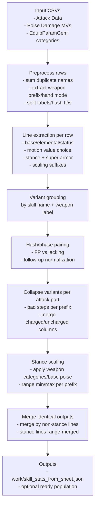
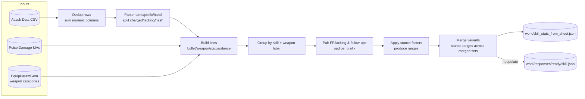

# Skill Stats Pipeline (scripts/generate_skill_stats.py)

This script builds `work/skill_stats_from_sheet.json` from `docs/(1.16.1)-Ashes-of-War-Attack-Data.csv` and can populate `work/responses/ready/skill.json` with per-weapon stat blocks.

## Quick usage

- Build stats only: `python scripts/generate_skill_stats.py`
- Limit to skills present in `ready/skill.json`: `python scripts/generate_skill_stats.py --ready-only`
- Populate `ready/skill.json` after generating stats: `python scripts/generate_skill_stats.py --populate`

Outputs:

- `work/skill_stats_from_sheet.json`: merged stats with a `weapon` list when variants share stats.
- `work/responses/ready/skill.json`: per-skill entry gains bracketed keys per weapon grouping and a `weapon` list; existing `stats` fields are left untouched.

## Implementation notes

- Parsing helpers: name cleanup lives in `split_skill_name`, `extract_weapon_prefix`, `canonical_skill_name`, and `strip_hash_variant`.
- Line building is split by kind: `build_bullet_lines`, `build_weapon_lines`, `build_status_multiplier_lines`, `build_stance_lines`, with `build_lines_for_row` orchestrating a row.
- Stance scaling and FP pairing are handled in `collapse_group`, `stance_factors`, and `apply_stance_scaling`; `normalize_stance_strings` performs the final rounding/formatting.
- Variant collapsing happens in `build_line_entries` (hash pairing) and `collapse_variants`/`collapse_variant_group` (charged vs uncharged), with `merge_identical_stats` merging identical outputs across weapons.
- Ready population is isolated in `populate_ready`; filtering for `--ready-only` uses `load_ready_names` + `make_ready_filter`.

## Data flow

1) Read the attack data CSV (motion values, base damages, status, poise).
2) Parse names into base skill + optional label (charged, R1/R2, lacking FP) and strip hash variants.
3) Extract stats:
   - Base/elemental/status lines are taken as-is.
   - Stance lines use `Poise Dmg MV`.
   - Flat super armor stance values come from `AtkSuperArmor` (add directly; no scaling).
4) Attach weapon metadata:
   - `[Weapon] ...` prefixes in the CSV or `Unique Skill Weapon` column become `weapon` labels.
   - EquipParamGem mount categories are used to fetch poise factors per weapon type.
5) Collapse variants:
   - Identical stats across weapons are merged into one entry with a `weapon` list.

   - Stance values are scaled by poise factors; min/max become ranges, lacking-FP defaults to 0 when absent.
   - Charged + uncharged are concatenated into one line when both exist, with `|` separating the variants (missing entries get `0` placeholders so column counts match).
   - Multi-step rows (`#1`, `#2`, etc.) keep a slot for every step across all lines in that attack section; missing steps are padded with zeros so timings stay aligned.
   - Nested bullet labels like `(Bullet (Ice Spikes))` are trimmed to `(Ice Spikes)` unless that trimmed label already exists, to avoid collisions.
   - Handedness variants (`1h`/`2h`) collapse into a single entry; each line gains a leading `(1h ...)` or `(2h ...)` prefix (paired with follow-up labels) and keeps its own uncharged/charged columns.
   - Duplicate-name sheet rows are summed first (numeric columns only) so multi-line entries like `Bubble Shower - Bullet` combine before formatting.
   - Step/variant padding is per attack part: only lines that share the same prefix (e.g., none/Light Follow-up/Heavy Follow-up plus hand mode) are padded to the same step count. Charged/uncharged columns are added only when that part has charged data; parts with no charged rows stay uncharged-only.

6) Populate `ready/skill.json`:

- Insert bracketed keys like `[Axe/Curved Sword/...] Skill` and `[Dragon Halberd] Skill`.
- Do not overwrite an existing `stats` field; only add variant keys and `weapon` metadata.

## Stance handling

- Poise scaling comes from:
  - `stance_categories` (EquipParamGem mount categories, `docs/weapon_categories_poise.json`)
  - `stance_base` (Unique Skill Weapon base poise)
- Zero/empty factors are dropped; at least one factor (1.0) is kept to avoid zeros.
- Ranges are min/max of the scaled values per position. Lacking-FP always emits a bracket; if missing in source, it is treated as 0.
- Bullet stance lines are treated as with-FP only; lacking values default to 0.
- `AtkSuperArmor` is treated as extra flat stance damage on that entry. Add it to the stance line without applying weapon/category scaling (e.g., Carian Sovereignty follow-ups).

## Ready-only behavior

`--ready-only` keeps any row whose canonical or bracket-stripped name matches a skill name in `ready/skill.json`. Bracketed variants are preserved under this mode.

## Common edits

- Add a new column: update the column lists near the top if you need a new damage type.
- Adjust stance wording: tweak the `label_text` construction in `build_line_entries`.
- Change rounding: stance ranges are rounded in `normalize_stance_strings` (base uses nearest int, lacking uses `ceil` on both ends; stance buckets from categories use `ceil`).

## Flow diagrams

## Regeneration checklist

1) Run `python scripts/generate_skill_stats.py --populate`.
2) Inspect key skills (e.g., Spinning Slash, Storm Assault) to confirm stance ranges and variant grouping.
3) If ashes are needed, run `python scripts/update_fmg_from_ready.py --generate-ash`.

## Gotchas

- Only one FMG slot per skill ID; per-weapon variants live as separate keys inside the same `skill.json` entry.
- Do not delete user-authored `stats` fields; the script already skips overwriting them.
- If the CSV adds new weapon prefixes, ensure `extract_weapon_prefix` still matches the pattern `[Weapon] Name`.
